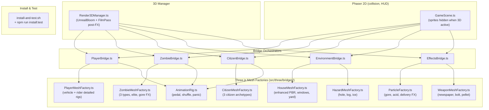

# Enhanced Graphics & Visual Display Implementation Plan

> **For agentic workers:** REQUIRED SUB-SKILL: Use superpowers:subagent-driven-development to implement this plan task-by-task. Steps use checkbox (`- [ ]`) syntax for tracking.

**Goal:** Dramatically upgrade the visual fidelity of all in-game entities — characters (player, zombies, citizens), vehicles, weapons, effects, hazards, and houses — using richly-detailed Three.js 3D procedural models, high-quality particle systems, PBR materials, and per-entity animated limb rigs, while adding a one-command local install script for live hot-reload testing.

**Architecture:** The game's existing Three.js bridge layer (`src/three/bridges/`) already owns the 3D render path; this plan enhances every bridge's mesh factory with detailed geometry, PBR materials, and per-entity skeletal-style animation rigs built entirely inside Three.js (no Godot export step needed — Godot was considered but the Web-first Phaser+Three stack is already wired and Vercel-ready, so we stay in-process). Each bridge gets a dedicated `*MeshFactory.ts` module following the pattern established by `HouseMeshFactory.ts`, with full TDD test coverage. A new `install-and-test.sh` script + `npm run install:test` alias lets anyone clone and launch with a single command.

**Architecture Diagram:**



**Tech Stack:** Three.js r171 (already installed), Phaser 3.90 (already installed), Vite 8 (already installed), TypeScript 6, Vitest 4, `three/examples/jsm/postprocessing` (FilmPass — no new npm deps).

## Global Constraints

- No new npm runtime dependencies — use only packages already in `package.json`.
- `VITE_RENDER3D=false` must still yield identical 2D gameplay — zero regression.
- Every mesh factory must have a corresponding `*.test.ts` in the same directory.
- All files must pass `npm run lint` and `npm run test` before commit.
- Vercel deployment (`npm run build`) must succeed with no new env vars required.
- Reduced-motion path must skip heavy particle effects and animations.
- Particle pool cap stays ≤ 200 (existing `PARTICLE_POOL_CAP` constant).
- Physics bodies remain untouched — only `setVisible(false)` on Phaser sprites.

---

## Task 1: Install & Live-Test Script

**Files:**
- Create: `install-and-test.sh`
- Modify: `package.json`

**Interfaces:**
- Produces: `npm run install:test` alias wiring `install-and-test.sh`

- [ ] **Step 1: Write failing test** — create `src/test/install-script.test.ts`

```typescript
// src/test/install-script.test.ts
import { existsSync } from 'fs';
import { join } from 'path';

describe('install-and-test.sh', () => {
  it('exists at project root', () => {
    expect(existsSync(join(process.cwd(), 'install-and-test.sh'))).toBe(true);
  });

  it('package.json has install:test script', async () => {
    const pkg = await import('../../package.json', { assert: { type: 'json' } });
    expect(pkg.default.scripts['install:test']).toBeDefined();
  });
});
```

- [ ] **Step 2: Run test to verify it fails**

```bash
npx vitest run src/test/install-script.test.ts
```
Expected: FAIL — file not found.

- [ ] **Step 3: Create `install-and-test.sh`**

```bash
#!/usr/bin/env bash
# install-and-test.sh — one-command local install + live-test launcher
# Usage:  bash install-and-test.sh
set -e

echo "🧟 ZombieSweep — install & live test"
echo "======================================"

NODE_MAJOR=$(node -e "process.stdout.write(process.version.split('.')[0].replace('v',''))")
if [ "$NODE_MAJOR" -lt 18 ]; then
  echo "❌  Node ≥18 required (found $(node --version)). Aborting."
  exit 1
fi

echo "📦  Installing dependencies…"
npm install

echo "🧪  Running unit tests…"
npm run test

echo "🚀  Starting dev server at http://localhost:5173"
echo "     Press Ctrl+C to stop."
npm run dev
```

- [ ] **Step 4: Add `install:test` to `package.json` scripts**

```diff
   "scripts": {
     "dev": "vite",
+    "install:test": "bash install-and-test.sh",
     "build": "tsc -p tsconfig.build.json && vite build",
```

- [ ] **Step 5: Mark script executable and run test**

```bash
chmod +x install-and-test.sh
npx vitest run src/test/install-script.test.ts
```
Expected: PASS

- [ ] **Step 6: Commit**

```bash
git add install-and-test.sh package.json src/test/install-script.test.ts
git commit -m "feat: add install-and-test.sh + npm run install:test"
```

---

## Task 2: Enhanced Post-FX Pipeline (Film Grain + Bloom API)

**Files:**
- Modify: `src/three/Render3DManager.ts`
- Modify: `src/three/Render3DManager.test.ts`

**Interfaces:**
- Produces: `setBloomStrength(strength: number): void` on `Render3DManager`; FilmPass in composer pipeline

> [!IMPORTANT]
> FilmPass adds film grain for a gritty apocalypse look. `setBloomStrength()` lets the combo light system punch bloom intensity during kill streaks.

- [ ] **Step 1: Write failing tests** — append to existing describe block in `src/three/Render3DManager.test.ts`

```typescript
it('creates FilmPass in the composer pipeline (≥3 passes) when active', () => {
  const mgr = new Render3DManager({
    enabled: true,
    rendererFactory: makeStubRenderer,
    host: makeStubHost(),
  });
  mgr.create();
  expect((mgr as unknown as { _passCount: number })._passCount).toBeGreaterThanOrEqual(3);
});

it('setBloomStrength clamps between 0 and 3', () => {
  const mgr = new Render3DManager({
    enabled: true,
    rendererFactory: makeStubRenderer,
    host: makeStubHost(),
  });
  mgr.create();
  mgr.setBloomStrength(5);
  expect((mgr as unknown as { _bloomStrength: number })._bloomStrength).toBe(3);
  mgr.setBloomStrength(-1);
  expect((mgr as unknown as { _bloomStrength: number })._bloomStrength).toBe(0);
});
```

- [ ] **Step 2: Run to confirm failure**

```bash
npx vitest run src/three/Render3DManager.test.ts
```
Expected: FAIL on the two new tests.

- [ ] **Step 3: Add FilmPass and `setBloomStrength` to `src/three/Render3DManager.ts`**

```diff
+import { FilmPass } from 'three/examples/jsm/postprocessing/FilmPass.js';
```

Add private fields (after `private composer`):
```diff
+  private bloomPass: UnrealBloomPass | null = null;
+  private _bloomStrength = 0.8;
+  get _passCount() { return this.composer?.passes.length ?? 0; }
```

In the `create()` method, capture `bloomPass` and add FilmPass:
```diff
-    const bloom = new UnrealBloomPass(new THREE.Vector2(w, h), 0.8, 0.6, 0.85);
+    this.bloomPass = new UnrealBloomPass(new THREE.Vector2(w, h), this._bloomStrength, 0.6, 0.85);
+    const bloom = this.bloomPass;
     composer.addPass(bloom);
     composer.addPass(new OutputPass());
+    composer.addPass(new FilmPass(0.25));
```

Add public method to the class:
```typescript
setBloomStrength(strength: number): void {
  this._bloomStrength = Math.max(0, Math.min(3, strength));
  if (this.bloomPass) {
    this.bloomPass.strength = this._bloomStrength;
  }
}
```

- [ ] **Step 4: Run tests**

```bash
npx vitest run src/three/Render3DManager.test.ts
```
Expected: ALL PASS

- [ ] **Step 5: Commit**

```bash
git add src/three/Render3DManager.ts src/three/Render3DManager.test.ts
git commit -m "feat(3d): FilmPass grain + setBloomStrength API in Render3DManager"
```

---

## Task 3: Detailed Player Vehicle Meshes (`PlayerMeshFactory.ts`)

**Files:**
- Create: `src/three/bridges/PlayerMeshFactory.ts`
- Create: `src/three/bridges/PlayerMeshFactory.test.ts`
- Modify: `src/three/bridges/PlayerBridge.ts` (replace inline `createPlayerVehicleMesh` with factory)

**Interfaces:**
- Consumes: `VehicleType` from `src/config/vehicles.ts`
- Produces: `createBicycleMesh(): THREE.Group`, `createRollerBladesMesh(): THREE.Group`, `createSkateboardMesh(): THREE.Group`, `createPlayerMeshForVehicle(type: VehicleType): THREE.Group`

- [ ] **Step 1: Write failing tests** — create `src/three/bridges/PlayerMeshFactory.test.ts`

```typescript
import * as THREE from 'three';
import { describe, it, expect } from 'vitest';
import {
  createBicycleMesh, createRollerBladesMesh, createSkateboardMesh, createPlayerMeshForVehicle,
} from './PlayerMeshFactory';
import { VehicleType } from '../../config/vehicles';

describe('PlayerMeshFactory', () => {
  it('createBicycleMesh returns THREE.Group', () => {
    expect(createBicycleMesh()).toBeInstanceOf(THREE.Group);
  });
  it('bicycle has ≥6 children (frame, bars, 2 wheels, torso, head)', () => {
    expect(createBicycleMesh().children.length).toBeGreaterThanOrEqual(6);
  });
  it('bicycle has ≥2 named wheel children for animation', () => {
    expect(createBicycleMesh().children.filter(c => c.name === 'wheel').length).toBeGreaterThanOrEqual(2);
  });
  it('bicycle rider has named torso child', () => {
    expect(createBicycleMesh().children.find(c => c.name === 'torso')).toBeDefined();
  });
  it('createRollerBladesMesh returns THREE.Group', () => {
    expect(createRollerBladesMesh()).toBeInstanceOf(THREE.Group);
  });
  it('createSkateboardMesh returns THREE.Group', () => {
    expect(createSkateboardMesh()).toBeInstanceOf(THREE.Group);
  });
  it('skateboard deck has name=deck for ollie animation', () => {
    expect(createSkateboardMesh().children.find(c => c.name === 'deck')).toBeDefined();
  });
  it('createPlayerMeshForVehicle dispatches on all VehicleType values', () => {
    expect(createPlayerMeshForVehicle(VehicleType.Bicycle)).toBeInstanceOf(THREE.Group);
    expect(createPlayerMeshForVehicle(VehicleType.RollerBlades)).toBeInstanceOf(THREE.Group);
    expect(createPlayerMeshForVehicle(VehicleType.Skateboard)).toBeInstanceOf(THREE.Group);
  });
});
```

- [ ] **Step 2: Run to confirm failure**

```bash
npx vitest run src/three/bridges/PlayerMeshFactory.test.ts
```
Expected: FAIL — module not found.

- [ ] **Step 3: Create `src/three/bridges/PlayerMeshFactory.ts`**

```typescript
import * as THREE from 'three';
import { VehicleType } from '../../config/vehicles';

const MAT = {
  bicycleFrame:   new THREE.MeshStandardMaterial({ color: 0xd93838, roughness: 0.35, metalness: 0.7 }),
  chrome:         new THREE.MeshStandardMaterial({ color: 0xd0d8e0, roughness: 0.1,  metalness: 0.95 }),
  rubber:         new THREE.MeshStandardMaterial({ color: 0x1a1a1a, roughness: 0.95, metalness: 0.0 }),
  skateboardDeck: new THREE.MeshStandardMaterial({ color: 0x3b82f6, roughness: 0.55, metalness: 0.1 }),
  trucks:         new THREE.MeshStandardMaterial({ color: 0xa0a0a0, roughness: 0.25, metalness: 0.85 }),
  bladeBoot:      new THREE.MeshStandardMaterial({ color: 0x10b981, roughness: 0.45, metalness: 0.3 }),
  skin:           new THREE.MeshStandardMaterial({ color: 0xffdbac, roughness: 0.85, metalness: 0.0 }),
  shirt:          new THREE.MeshStandardMaterial({ color: 0xf3f4f6, roughness: 0.8,  metalness: 0.0 }),
  helmet:         new THREE.MeshStandardMaterial({ color: 0x111827, roughness: 0.4,  metalness: 0.5 }),
  jeans:          new THREE.MeshStandardMaterial({ color: 0x1e3a5f, roughness: 0.9,  metalness: 0.0 }),
};

function addRider(group: THREE.Group, baseY: number): void {
  const legGeom = new THREE.BoxGeometry(2.5, 9, 3);
  [-2, 2].forEach((x, i) => {
    const leg = new THREE.Mesh(legGeom, MAT.jeans);
    leg.name = i === 0 ? 'legL' : 'legR';
    leg.position.set(x, baseY + 4.5, 0);
    group.add(leg);
  });

  const torso = new THREE.Mesh(new THREE.BoxGeometry(7, 10, 4), MAT.shirt);
  torso.name = 'torso';
  torso.position.set(0, baseY + 14, 0);
  group.add(torso);

  const armGeom = new THREE.BoxGeometry(2, 8, 2.5);
  [-5.5, 5.5].forEach((x, i) => {
    const arm = new THREE.Mesh(armGeom, MAT.shirt);
    arm.name = i === 0 ? 'armL' : 'armR';
    arm.position.set(x, baseY + 14, 3);
    arm.rotation.x = -0.4;
    group.add(arm);
  });

  const head = new THREE.Mesh(new THREE.SphereGeometry(3.2, 12, 8), MAT.skin);
  head.name = 'head';
  head.position.set(0, baseY + 21, 0);
  group.add(head);

  const helmet = new THREE.Mesh(new THREE.SphereGeometry(3.6, 12, 8), MAT.helmet);
  helmet.name = 'helmet';
  helmet.scale.set(1, 0.7, 1);
  helmet.position.set(0, baseY + 23.5, 0);
  group.add(helmet);
}

export function createBicycleMesh(): THREE.Group {
  const group = new THREE.Group();

  // Frame tubes
  const downTube = new THREE.Mesh(new THREE.CylinderGeometry(0.8, 0.8, 18, 8), MAT.bicycleFrame);
  downTube.name = 'frame'; downTube.position.set(0, 9, 0); downTube.rotation.z = Math.PI * 0.05;
  group.add(downTube);

  const topTube = new THREE.Mesh(new THREE.CylinderGeometry(0.7, 0.7, 15, 8), MAT.bicycleFrame);
  topTube.name = 'frame'; topTube.position.set(0, 13, 0); topTube.rotation.x = Math.PI / 2;
  group.add(topTube);

  // Handlebars
  const bar = new THREE.Mesh(new THREE.BoxGeometry(13, 1.2, 1.5), MAT.chrome);
  bar.name = 'handlebar'; bar.position.set(0, 14, 7);
  group.add(bar);

  // Wheels (cylinder, rotated to roll on Z axis)
  const wheelGeom = new THREE.CylinderGeometry(6, 6, 1.5, 16);
  wheelGeom.rotateZ(Math.PI / 2);
  [9, -9].forEach(z => {
    const w = new THREE.Mesh(wheelGeom, MAT.rubber);
    w.name = 'wheel'; w.position.set(0, 6, z);
    group.add(w);
  });

  // Pedal
  const pedal = new THREE.Mesh(new THREE.BoxGeometry(3, 0.8, 1.5), MAT.chrome);
  pedal.name = 'pedal'; pedal.position.set(0, 7, 0);
  group.add(pedal);

  addRider(group, 9);
  return group;
}

export function createSkateboardMesh(): THREE.Group {
  const group = new THREE.Group();

  const deck = new THREE.Mesh(new THREE.BoxGeometry(9, 1.5, 24), MAT.skateboardDeck);
  deck.name = 'deck'; deck.position.y = 4;
  group.add(deck);

  // Kicktail nose
  const nose = new THREE.Mesh(new THREE.BoxGeometry(9, 1, 4), MAT.skateboardDeck);
  nose.name = 'deck'; nose.position.set(0, 5.5, 13); nose.rotation.x = -0.4;
  group.add(nose);

  // Trucks
  [-8, 8].forEach(z => {
    const truck = new THREE.Mesh(new THREE.BoxGeometry(10, 1.5, 3), MAT.trucks);
    truck.name = 'truck'; truck.position.set(0, 2.5, z);
    group.add(truck);
  });

  // Wheels
  const wGeom = new THREE.CylinderGeometry(2, 2, 1.5, 12);
  wGeom.rotateZ(Math.PI / 2);
  [[-4, 1.8, -8], [4, 1.8, -8], [-4, 1.8, 8], [4, 1.8, 8]].forEach(([x, y, z]) => {
    const w = new THREE.Mesh(wGeom, MAT.rubber);
    w.name = 'wheel'; w.position.set(x, y, z);
    group.add(w);
  });

  addRider(group, 4);
  return group;
}

export function createRollerBladesMesh(): THREE.Group {
  const group = new THREE.Group();
  const bootGeom = new THREE.BoxGeometry(4, 9, 10);

  [-4, 4].forEach((x, i) => {
    const boot = new THREE.Mesh(bootGeom, MAT.bladeBoot);
    boot.name = i === 0 ? 'bootL' : 'bootR';
    boot.position.set(x, 5, 0);
    group.add(boot);

    const cuff = new THREE.Mesh(new THREE.BoxGeometry(4.5, 2.5, 10.5), MAT.chrome);
    cuff.name = 'cuff'; cuff.position.set(x, 9.5, 0);
    group.add(cuff);

    // 4 inline wheels per boot
    const wGeom = new THREE.SphereGeometry(1.5, 10, 10);
    [-4, -1.5, 1.5, 4].forEach(z => {
      const w = new THREE.Mesh(wGeom, MAT.rubber);
      w.name = 'wheel'; w.position.set(x, 1.5, z);
      group.add(w);
    });
  });

  addRider(group, 10);
  return group;
}

export function createPlayerMeshForVehicle(type: VehicleType): THREE.Group {
  switch (type) {
    case VehicleType.Bicycle:     return createBicycleMesh();
    case VehicleType.Skateboard:  return createSkateboardMesh();
    case VehicleType.RollerBlades: return createRollerBladesMesh();
  }
}
```

- [ ] **Step 4: Update `src/three/bridges/PlayerBridge.ts`**

```diff
+import { createPlayerMeshForVehicle } from './PlayerMeshFactory';
```

In `createMesh()`:
```diff
-    const group = createPlayerVehicleMesh(playerItem.vehicle);
+    const group = createPlayerMeshForVehicle(playerItem.vehicle);
```

Delete the entire inline `createPlayerVehicleMesh` function (lines ~104–206 in PlayerBridge.ts).

- [ ] **Step 5: Run tests**

```bash
npx vitest run src/three/bridges/PlayerMeshFactory.test.ts
npx vitest run src/three/bridges/PlayerBridge.test.ts
```
Expected: ALL PASS

- [ ] **Step 6: Commit**

```bash
git add src/three/bridges/PlayerMeshFactory.ts src/three/bridges/PlayerMeshFactory.test.ts \
        src/three/bridges/PlayerBridge.ts
git commit -m "feat(3d): detailed player vehicle mesh factory (bicycle/skateboard/rollerblades)"
```

---

## Task 4: Enhanced Zombie Mesh Factory (`ZombieMeshFactory.ts`)

**Files:**
- Create: `src/three/bridges/ZombieMeshFactory.ts`
- Create: `src/three/bridges/ZombieMeshFactory.test.ts`
- Modify: `src/three/bridges/ZombieBridge.ts` (replace inline `createZombieMesh` with factory)

**Interfaces:**
- Consumes: `ZombieType` from `src/entities/Zombie.ts`
- Produces: `createShamblerMesh(elite: boolean): THREE.Group`, `createRunnerMesh(elite: boolean): THREE.Group`, `createSpitterMesh(elite: boolean): THREE.Group`, `createZombieMeshForType(type: ZombieType, elite: boolean): THREE.Group`

- [ ] **Step 1: Write failing tests** — create `src/three/bridges/ZombieMeshFactory.test.ts`

```typescript
import * as THREE from 'three';
import { describe, it, expect } from 'vitest';
import { createShamblerMesh, createRunnerMesh, createSpitterMesh, createZombieMeshForType } from './ZombieMeshFactory';
import { ZombieType } from '../../entities/Zombie';

describe('ZombieMeshFactory', () => {
  it('createShamblerMesh returns THREE.Group', () => {
    expect(createShamblerMesh(false)).toBeInstanceOf(THREE.Group);
  });
  it('shambler has ≥4 children (torso, head, 2 arms)', () => {
    expect(createShamblerMesh(false).children.length).toBeGreaterThanOrEqual(4);
  });
  it('shambler non-elite has no visor', () => {
    expect(createShamblerMesh(false).children.find(c => c.name === 'visor')).toBeUndefined();
  });
  it('shambler elite has visor', () => {
    expect(createShamblerMesh(true).children.find(c => c.name === 'visor')).toBeDefined();
  });
  it('runner mesh has taller bounding box than shambler', () => {
    const rb = new THREE.Box3().setFromObject(createRunnerMesh(false));
    const sb = new THREE.Box3().setFromObject(createShamblerMesh(false));
    expect(rb.max.y).toBeGreaterThan(sb.max.y);
  });
  it('spitter has acidSac child', () => {
    expect(createSpitterMesh(false).children.find(c => c.name === 'acidSac')).toBeDefined();
  });
  it('createZombieMeshForType dispatches all types', () => {
    expect(createZombieMeshForType(ZombieType.Shambler, false)).toBeInstanceOf(THREE.Group);
    expect(createZombieMeshForType(ZombieType.Runner,   false)).toBeInstanceOf(THREE.Group);
    expect(createZombieMeshForType(ZombieType.Spitter,  false)).toBeInstanceOf(THREE.Group);
  });
});
```

- [ ] **Step 2: Run to confirm failure**

```bash
npx vitest run src/three/bridges/ZombieMeshFactory.test.ts
```
Expected: FAIL.

- [ ] **Step 3: Create `src/three/bridges/ZombieMeshFactory.ts`**

```typescript
import * as THREE from 'three';
import { ZombieType } from '../../entities/Zombie';

const BONE_WHITE    = 0xede0c8;
const GORE_RED      = 0x8b0000;

function mat(color: number, roughness = 0.8): THREE.MeshStandardMaterial {
  return new THREE.MeshStandardMaterial({ color, roughness, metalness: 0.05 });
}

function addCore(group: THREE.Group, bodyColor: number, torsoH: number, headR: number): void {
  // Torso
  const body = new THREE.Mesh(new THREE.BoxGeometry(7, torsoH, 4.5), mat(bodyColor));
  body.name = 'torso'; body.position.y = torsoH / 2;
  group.add(body);

  // Exposed ribs
  const ribMat = mat(BONE_WHITE, 0.6);
  [-2, 0, 2].forEach(dy => {
    const rib = new THREE.Mesh(new THREE.BoxGeometry(7.5, 0.8, 0.6), ribMat);
    rib.name = 'rib'; rib.position.set(0, torsoH / 2 + dy, 2.4);
    group.add(rib);
  });

  // Head
  const head = new THREE.Mesh(new THREE.SphereGeometry(headR, 10, 8), mat(bodyColor, 0.7));
  head.name = 'head'; head.position.y = torsoH + headR + 1;
  group.add(head);

  // Jaw
  const jaw = new THREE.Mesh(new THREE.BoxGeometry(headR * 1.4, headR * 0.4, headR * 0.9), mat(bodyColor));
  jaw.name = 'jaw'; jaw.position.set(0, torsoH + headR * 0.5, headR * 0.6);
  group.add(jaw);

  // Arms
  const armGeom = new THREE.BoxGeometry(2, 2.5, 10);
  [-4.5, 4.5].forEach((x, i) => {
    const arm = new THREE.Mesh(armGeom, mat(bodyColor, 0.85));
    arm.name = i === 0 ? 'armL' : 'armR';
    arm.position.set(x, torsoH * 0.7, 4);
    group.add(arm);

    const hand = new THREE.Mesh(new THREE.SphereGeometry(1.5, 6, 6), mat(GORE_RED, 0.9));
    hand.name = 'hand'; hand.position.set(x, torsoH * 0.7, 9);
    group.add(hand);
  });
}

function addEliteVisor(group: THREE.Group, headY: number): void {
  const visorMat = new THREE.MeshStandardMaterial({
    color: 0xff0000,
    emissive: new THREE.Color(0xff3333),
    emissiveIntensity: 3.5,
  });
  const visor = new THREE.Mesh(new THREE.BoxGeometry(4.5, 1.2, 1), visorMat);
  visor.name = 'visor'; visor.position.set(0, headY, 2.8);
  group.add(visor);
  group.scale.setScalar(1.3);
}

export function createShamblerMesh(elite: boolean): THREE.Group {
  const group = new THREE.Group();
  addCore(group, 0x4caf50, 13, 3.8);
  // Torn shirt
  const shirt = new THREE.Mesh(new THREE.BoxGeometry(7.5, 5, 1), mat(0x3a3a3a, 0.95));
  shirt.name = 'shirt'; shirt.position.set(0, 9, 2.4);
  group.add(shirt);
  if (elite) addEliteVisor(group, 15);
  return group;
}

export function createRunnerMesh(elite: boolean): THREE.Group {
  const group = new THREE.Group();
  addCore(group, 0xc62828, 16, 3.2);
  group.rotation.x = -0.3; // lean forward
  const jacket = new THREE.Mesh(new THREE.BoxGeometry(8, 7, 1.5), mat(0x1a1a1a, 0.7));
  jacket.name = 'jacket'; jacket.position.set(0, 11, 2.5);
  group.add(jacket);
  if (elite) addEliteVisor(group, 18);
  return group;
}

export function createSpitterMesh(elite: boolean): THREE.Group {
  const group = new THREE.Group();
  addCore(group, 0x827717, 12, 4.2);
  // Bloated acid sac
  const sacMat = new THREE.MeshStandardMaterial({
    color: 0xc5e01a,
    emissive: new THREE.Color(0x99b800),
    emissiveIntensity: 0.5,
    roughness: 0.3,
  });
  const acidSac = new THREE.Mesh(new THREE.SphereGeometry(4, 10, 10), sacMat);
  acidSac.name = 'acidSac'; acidSac.scale.set(1, 0.8, 0.9); acidSac.position.set(0, 4, 3);
  group.add(acidSac);
  if (elite) addEliteVisor(group, 14);
  return group;
}

export function createZombieMeshForType(type: ZombieType, elite: boolean): THREE.Group {
  switch (type) {
    case ZombieType.Shambler: return createShamblerMesh(elite);
    case ZombieType.Runner:   return createRunnerMesh(elite);
    case ZombieType.Spitter:  return createSpitterMesh(elite);
  }
}
```

- [ ] **Step 4: Update `src/three/bridges/ZombieBridge.ts`**

```diff
+import { createZombieMeshForType } from './ZombieMeshFactory';
```

In `createMesh()`:
```diff
-    const group = createZombieMesh(zombieItem.type, zombieItem.elite);
+    const group = createZombieMeshForType(zombieItem.type, zombieItem.elite);
```

Delete the inline `createZombieMesh` function (lines ~97–155 in ZombieBridge.ts).

- [ ] **Step 5: Run tests**

```bash
npx vitest run src/three/bridges/ZombieMeshFactory.test.ts
npx vitest run src/three/bridges/ZombieBridge.test.ts
```
Expected: ALL PASS

- [ ] **Step 6: Commit**

```bash
git add src/three/bridges/ZombieMeshFactory.ts src/three/bridges/ZombieMeshFactory.test.ts \
        src/three/bridges/ZombieBridge.ts
git commit -m "feat(3d): detailed zombie mesh factory (shambler/runner/spitter + elite glow)"
```

---

## Task 5: Citizen Mesh Factory + CitizenBridge

**Files:**
- Create: `src/three/bridges/CitizenMeshFactory.ts`
- Create: `src/three/bridges/CitizenMeshFactory.test.ts`
- Create: `src/three/bridges/CitizenBridge.ts`
- Create: `src/three/bridges/CitizenBridge.test.ts`
- Modify: `src/scenes/GameScene.ts` (wire CitizenBridge into 3D layer init/sync/teardown)

**Interfaces:**
- Consumes: `CitizenType` from `src/entities/Citizen.ts`
- Produces: `createCitizenMeshForType(type: CitizenType): THREE.Group`; `CitizenBridge` class

- [ ] **Step 1: Write failing factory tests** — create `src/three/bridges/CitizenMeshFactory.test.ts`

```typescript
import * as THREE from 'three';
import { describe, it, expect } from 'vitest';
import { createCitizenMeshForType } from './CitizenMeshFactory';
import { CitizenType } from '../../entities/Citizen';

describe('CitizenMeshFactory', () => {
  it('FriendlyNeighbor returns THREE.Group', () => {
    expect(createCitizenMeshForType(CitizenType.FriendlyNeighbor)).toBeInstanceOf(THREE.Group);
  });
  it('PanickedRunner returns THREE.Group', () => {
    expect(createCitizenMeshForType(CitizenType.PanickedRunner)).toBeInstanceOf(THREE.Group);
  });
  it('ArmedSurvivalist returns THREE.Group', () => {
    expect(createCitizenMeshForType(CitizenType.ArmedSurvivalist)).toBeInstanceOf(THREE.Group);
  });
  it('ArmedSurvivalist has weapon child', () => {
    const g = createCitizenMeshForType(CitizenType.ArmedSurvivalist);
    expect(g.children.find(c => c.name === 'weapon')).toBeDefined();
  });
  it('PanickedRunner is leaned forward (rotation.x < 0)', () => {
    const g = createCitizenMeshForType(CitizenType.PanickedRunner);
    expect(g.rotation.x).toBeLessThan(0);
  });
});
```

- [ ] **Step 2: Run to confirm failure**

```bash
npx vitest run src/three/bridges/CitizenMeshFactory.test.ts
```
Expected: FAIL.

- [ ] **Step 3: Create `src/three/bridges/CitizenMeshFactory.ts`**

```typescript
import * as THREE from 'three';
import { CitizenType } from '../../entities/Citizen';

const MAT = {
  skin:      new THREE.MeshStandardMaterial({ color: 0xffd5a8, roughness: 0.85 }),
  hair:      new THREE.MeshStandardMaterial({ color: 0x4e3324, roughness: 0.9 }),
  shirtBlue: new THREE.MeshStandardMaterial({ color: 0x1e3a8a, roughness: 0.8 }),
  shirtOrng: new THREE.MeshStandardMaterial({ color: 0xea580c, roughness: 0.8 }),
  shirtGray: new THREE.MeshStandardMaterial({ color: 0x374151, roughness: 0.6, metalness: 0.2 }),
  pants:     new THREE.MeshStandardMaterial({ color: 0x374151, roughness: 0.9 }),
  shoes:     new THREE.MeshStandardMaterial({ color: 0x1a1a1a, roughness: 0.95 }),
  gun:       new THREE.MeshStandardMaterial({ color: 0x1c1c1c, roughness: 0.3, metalness: 0.9 }),
};

function buildHumanoid(shirtMat: THREE.MeshStandardMaterial): THREE.Group {
  const group = new THREE.Group();

  // Feet
  [-1.5, 1.5].forEach(x => {
    const foot = new THREE.Mesh(new THREE.BoxGeometry(2, 1.5, 4), MAT.shoes);
    foot.name = 'foot'; foot.position.set(x, 0.75, 0);
    group.add(foot);
  });

  // Legs
  const legGeom = new THREE.BoxGeometry(2.5, 9, 3);
  [-1.5, 1.5].forEach((x, i) => {
    const leg = new THREE.Mesh(legGeom, MAT.pants);
    leg.name = i === 0 ? 'legL' : 'legR'; leg.position.set(x, 6, 0);
    group.add(leg);
  });

  // Torso
  const torso = new THREE.Mesh(new THREE.BoxGeometry(7, 9, 4), shirtMat);
  torso.name = 'torso'; torso.position.set(0, 15, 0);
  group.add(torso);

  // Arms
  const armGeom = new THREE.BoxGeometry(2, 8, 2.5);
  [-5.5, 5.5].forEach((x, i) => {
    const arm = new THREE.Mesh(armGeom, shirtMat);
    arm.name = i === 0 ? 'armL' : 'armR'; arm.position.set(x, 14, 0);
    group.add(arm);
  });

  // Head
  const head = new THREE.Mesh(new THREE.SphereGeometry(3.2, 12, 8), MAT.skin);
  head.name = 'head'; head.position.set(0, 22, 0);
  group.add(head);

  // Hair cap
  const hair = new THREE.Mesh(new THREE.SphereGeometry(3.4, 10, 6), MAT.hair);
  hair.name = 'hair'; hair.scale.set(1, 0.55, 1); hair.position.set(0, 25, 0);
  group.add(hair);

  return group;
}

export function createFriendlyNeighborMesh(): THREE.Group {
  return buildHumanoid(MAT.shirtBlue);
}

export function createPanickedRunnerMesh(): THREE.Group {
  const g = buildHumanoid(MAT.shirtOrng);
  g.rotation.x = -0.35; // lean forward in panic
  return g;
}

export function createArmedSurvivalistMesh(): THREE.Group {
  const g = buildHumanoid(MAT.shirtGray);

  // Rifle
  const rifle = new THREE.Group();
  const barrel = new THREE.Mesh(new THREE.CylinderGeometry(0.5, 0.5, 14, 8), MAT.gun);
  barrel.rotation.z = Math.PI / 2; barrel.position.x = 7;
  rifle.add(barrel);
  const stock = new THREE.Mesh(new THREE.BoxGeometry(5, 2, 2), MAT.gun);
  stock.position.x = -2;
  rifle.add(stock);
  rifle.name = 'weapon';
  rifle.position.set(5.5, 13, 2); rifle.rotation.set(0.2, 0, 0);
  g.add(rifle);

  return g;
}

export function createCitizenMeshForType(type: CitizenType): THREE.Group {
  switch (type) {
    case CitizenType.FriendlyNeighbor:  return createFriendlyNeighborMesh();
    case CitizenType.PanickedRunner:    return createPanickedRunnerMesh();
    case CitizenType.ArmedSurvivalist:  return createArmedSurvivalistMesh();
  }
}
```

- [ ] **Step 4: Create `src/three/bridges/CitizenBridge.ts`**

```typescript
import * as THREE from 'three';
import { SyncBridge, type BridgeUpdateArgs } from './SyncBridge';
import { CitizenType } from '../../entities/Citizen';
import { createCitizenMeshForType } from './CitizenMeshFactory';
import { worldToThree, type CameraView, type OrthoConfig } from '../projection';
import { depthRenderOrder, depthZOffset } from '../depthBand';

export interface CitizenSourceItem {
  type: CitizenType;
  sprite: { x: number; y: number; rotation: number; visible: boolean; setVisible(v: boolean): void };
}

export interface CitizenBridgeUpdate extends BridgeUpdateArgs<THREE.Scene> {
  source: CitizenSourceItem[];
  cam: CameraView;
  dt: number;
}

export class CitizenBridge extends SyncBridge<THREE.Group, THREE.Scene> {
  private cam: CameraView = { scrollX: 0, scrollY: 0, zoom: 1 };
  private readonly cfg: OrthoConfig;

  constructor(private readonly scene: THREE.Scene, cfg: OrthoConfig) {
    super();
    this.cfg = cfg;
  }

  update(args: CitizenBridgeUpdate): void {
    if (!args.source) return;
    this.cam = args.cam;
    super.update({ source: args.source, host: args.host });
  }

  protected createMesh(item: unknown): THREE.Group {
    const ci = item as CitizenSourceItem;
    const group = createCitizenMeshForType(ci.type);
    group.renderOrder = depthRenderOrder('actor');
    group.position.z = depthZOffset('actor');
    return group;
  }

  protected onAddToHost(mesh: THREE.Group, host: THREE.Scene): void { host.add(mesh); }

  protected onRemoveFromHost(mesh: THREE.Group, host: THREE.Scene): void {
    host.remove(mesh);
    mesh.traverse(o => {
      if (o instanceof THREE.Mesh) {
        o.geometry.dispose();
        const m = o.material;
        Array.isArray(m) ? m.forEach(x => x.dispose()) : m.dispose();
      }
    });
  }

  protected onDisabled(source: unknown[]): void {
    (source as CitizenSourceItem[]).forEach(i => i.sprite.setVisible(true));
  }

  protected syncMeshes(source: unknown[]): void {
    const items = source as CitizenSourceItem[];
    for (let i = 0; i < items.length; i++) {
      const { sprite } = items[i];
      sprite.setVisible(false);
      const p = worldToThree(sprite.x, sprite.y, this.cam, this.cfg);
      this.liveMeshes[i].position.set(p.x, 0, p.z);
      this.liveMeshes[i].rotation.y = -sprite.rotation;
    }
  }

  override teardown(): void { super.teardown(this.scene); }
}
```

- [ ] **Step 5: Create `src/three/bridges/CitizenBridge.test.ts`**

```typescript
import * as THREE from 'three';
import { describe, it, expect } from 'vitest';
import { CitizenBridge } from './CitizenBridge';
import { defaultOrthoConfig } from '../projection';

const makeScene = () => ({ add: () => {}, remove: () => {}, children: [] } as unknown as THREE.Scene);

describe('CitizenBridge', () => {
  it('creates without error', () => {
    expect(() => new CitizenBridge(makeScene(), defaultOrthoConfig)).not.toThrow();
  });
  it('update with empty source does not throw', () => {
    const b = new CitizenBridge(makeScene(), defaultOrthoConfig);
    expect(() => b.update({ source: [], cam: { scrollX: 0, scrollY: 0, zoom: 1 }, dt: 16, host: makeScene() })).not.toThrow();
  });
});
```

- [ ] **Step 6: Wire `CitizenBridge` into `src/scenes/GameScene.ts`**

Add import alongside `ZombieBridge`:
```diff
+import { CitizenBridge, type CitizenSourceItem } from '../three/bridges/CitizenBridge';
```

Add field `private citizenBridge: CitizenBridge | null = null;` after `zombieBridge`.

In `init3DLayer()` (where zombieBridge is created):
```typescript
this.citizenBridge = new CitizenBridge(/* scene */, /* cfg */);
```

In `syncRender3DLayer()` (after zombieBridge sync):
```typescript
if (this.citizenBridge) {
  const citizenSource: CitizenSourceItem[] = this.citizens.map(c => ({
    type: c.type as CitizenType,
    sprite: c.sprite,
  }));
  this.citizenBridge.update({ source: citizenSource, cam, dt, host: scene });
}
```

In `teardownRender3DLayer()`:
```typescript
this.citizenBridge?.teardown();
this.citizenBridge = null;
```

- [ ] **Step 7: Run tests**

```bash
npx vitest run src/three/bridges/CitizenMeshFactory.test.ts
npx vitest run src/three/bridges/CitizenBridge.test.ts
npm run test
```
Expected: ALL PASS

- [ ] **Step 8: Commit**

```bash
git add src/three/bridges/CitizenMeshFactory.ts src/three/bridges/CitizenMeshFactory.test.ts \
        src/three/bridges/CitizenBridge.ts src/three/bridges/CitizenBridge.test.ts \
        src/scenes/GameScene.ts
git commit -m "feat(3d): citizen mesh factory (neighbor/panicked/armed) + CitizenBridge wired"
```

---

## Task 6: Weapon Mesh Factory (`WeaponMeshFactory.ts`) + Projectile Visuals

**Files:**
- Create: `src/three/bridges/WeaponMeshFactory.ts`
- Create: `src/three/bridges/WeaponMeshFactory.test.ts`
- Modify: `src/three/bridges/EffectsBridge.ts` (use vehicle-appropriate projectile meshes)

**Interfaces:**
- Consumes: `VehicleType` from `src/config/vehicles.ts`
- Produces: `createNewspaperMesh(): THREE.Group`, `createBoltMesh(): THREE.Group`, `createShotgunPelletMesh(): THREE.Mesh`, `createProjectileMeshForVehicle(v: VehicleType): THREE.Mesh | THREE.Group`

- [ ] **Step 1: Write failing tests** — create `src/three/bridges/WeaponMeshFactory.test.ts`

```typescript
import * as THREE from 'three';
import { describe, it, expect } from 'vitest';
import { createNewspaperMesh, createBoltMesh, createShotgunPelletMesh, createProjectileMeshForVehicle } from './WeaponMeshFactory';
import { VehicleType } from '../../config/vehicles';

describe('WeaponMeshFactory', () => {
  it('createNewspaperMesh returns THREE.Group with ≥2 children (roll + band)', () => {
    const g = createNewspaperMesh();
    expect(g).toBeInstanceOf(THREE.Group);
    expect(g.children.length).toBeGreaterThanOrEqual(2);
  });
  it('newspaper has roll child', () => {
    expect(createNewspaperMesh().children.find(c => c.name === 'roll')).toBeDefined();
  });
  it('createBoltMesh returns THREE.Group with shaft + tip', () => {
    const g = createBoltMesh();
    expect(g).toBeInstanceOf(THREE.Group);
    expect(g.children.find(c => c.name === 'shaft')).toBeDefined();
    expect(g.children.find(c => c.name === 'tip')).toBeDefined();
  });
  it('createShotgunPelletMesh returns THREE.Mesh', () => {
    expect(createShotgunPelletMesh()).toBeInstanceOf(THREE.Mesh);
  });
  it('createProjectileMeshForVehicle returns object for each type', () => {
    expect(createProjectileMeshForVehicle(VehicleType.Bicycle)).toBeDefined();
    expect(createProjectileMeshForVehicle(VehicleType.RollerBlades)).toBeDefined();
    expect(createProjectileMeshForVehicle(VehicleType.Skateboard)).toBeDefined();
  });
});
```

- [ ] **Step 2: Run to confirm failure**

```bash
npx vitest run src/three/bridges/WeaponMeshFactory.test.ts
```
Expected: FAIL.

- [ ] **Step 3: Create `src/three/bridges/WeaponMeshFactory.ts`**

```typescript
import * as THREE from 'three';
import { VehicleType } from '../../config/vehicles';

const MAT = {
  paper:    new THREE.MeshStandardMaterial({ color: 0xfaf3e0, roughness: 0.9 }),
  band:     new THREE.MeshStandardMaterial({ color: 0x0e7490, roughness: 0.8 }),
  bolt:     new THREE.MeshStandardMaterial({ color: 0x2c3e50, roughness: 0.4, metalness: 0.7 }),
  boltTip:  new THREE.MeshStandardMaterial({ color: 0xaaaaaa, roughness: 0.2, metalness: 0.9 }),
  fletch:   new THREE.MeshStandardMaterial({ color: 0xcc4444, roughness: 0.9 }),
  pellet:   new THREE.MeshStandardMaterial({
              color: 0xd0a020, roughness: 0.3, metalness: 0.8,
              emissive: new THREE.Color(0x804000), emissiveIntensity: 0.6 }),
};

export function createNewspaperMesh(): THREE.Group {
  const group = new THREE.Group();

  const rollGeom = new THREE.CylinderGeometry(1.2, 1.2, 8, 10);
  const roll = new THREE.Mesh(rollGeom, MAT.paper);
  roll.name = 'roll'; roll.rotation.z = Math.PI / 2;
  group.add(roll);

  const band = new THREE.Mesh(new THREE.TorusGeometry(1.3, 0.25, 6, 16), MAT.band);
  band.name = 'band'; band.rotation.x = Math.PI / 2;
  group.add(band);

  return group;
}

export function createBoltMesh(): THREE.Group {
  const group = new THREE.Group();

  const shaft = new THREE.Mesh(new THREE.CylinderGeometry(0.3, 0.3, 10, 6), MAT.bolt);
  shaft.name = 'shaft'; shaft.rotation.z = Math.PI / 2;
  group.add(shaft);

  const tip = new THREE.Mesh(new THREE.ConeGeometry(0.5, 2.5, 6), MAT.boltTip);
  tip.name = 'tip'; tip.rotation.z = -Math.PI / 2; tip.position.x = 5.5;
  group.add(tip);

  // Fletching (2 fins at 90°)
  const fletchGeom = new THREE.BoxGeometry(0.2, 2, 1.2);
  [0, Math.PI / 2].forEach(ry => {
    const f = new THREE.Mesh(fletchGeom, MAT.fletch);
    f.name = 'fletch'; f.rotation.z = Math.PI / 2; f.rotation.y = ry; f.position.x = -4.5;
    group.add(f);
  });

  return group;
}

export function createShotgunPelletMesh(): THREE.Mesh {
  return new THREE.Mesh(new THREE.SphereGeometry(1.5, 6, 6), MAT.pellet);
}

export function createProjectileMeshForVehicle(vehicle: VehicleType): THREE.Group | THREE.Mesh {
  switch (vehicle) {
    case VehicleType.Bicycle:      return createNewspaperMesh();
    case VehicleType.RollerBlades: return createBoltMesh();
    case VehicleType.Skateboard:   return createShotgunPelletMesh();
  }
}
```

- [ ] **Step 4: Update `src/three/bridges/EffectsBridge.ts`** to expose `vehicleType` and swap projectile mesh

Add import:
```diff
+import { createProjectileMeshForVehicle } from './WeaponMeshFactory';
+import { VehicleType } from '../../config/vehicles';
```

Add `vehicleType?: VehicleType` to `EffectsBridgeSource`:
```diff
 export interface EffectsBridgeSource {
   projectiles: ProjectileSourceItem[];
   killEvents: KillEvent[];
   comboTier: number;
+  vehicleType?: VehicleType;
 }
```

In the bridge class, add private field `private _vehicleType?: VehicleType;` and set it from source in `update()`.

Override `createMesh()` to use vehicle-appropriate mesh:
```typescript
protected createMesh(_item: unknown): THREE.Mesh {
  if (this._vehicleType) {
    const obj = createProjectileMeshForVehicle(this._vehicleType);
    return obj instanceof THREE.Mesh ? obj : (obj.children[0] as THREE.Mesh);
  }
  return new THREE.Mesh(PARTICLE_GEOM, PARTICLE_MAT);
}
```

- [ ] **Step 5: Run tests**

```bash
npx vitest run src/three/bridges/WeaponMeshFactory.test.ts
npx vitest run src/three/bridges/EffectsBridge.test.ts
```
Expected: ALL PASS

- [ ] **Step 6: Commit**

```bash
git add src/three/bridges/WeaponMeshFactory.ts src/three/bridges/WeaponMeshFactory.test.ts \
        src/three/bridges/EffectsBridge.ts
git commit -m "feat(3d): weapon mesh factory (newspaper/bolt/pellet) + vehicle-typed projectiles"
```

---

## Task 7: Particle System Overhaul (`ParticleFactory.ts`)

**Files:**
- Create: `src/three/bridges/ParticleFactory.ts`
- Create: `src/three/bridges/ParticleFactory.test.ts`
- Modify: `src/three/bridges/EffectsBridge.ts` (use `ParticlePool` + new spawn functions)

**Interfaces:**
- Produces: `class ParticlePool { cap, liveCount, acquire(), addLive(), tick() }`, `spawnGoreBurst()`, `spawnAcidSplash()`, `spawnNewspaperDelivery()`

- [ ] **Step 1: Write failing tests** — create `src/three/bridges/ParticleFactory.test.ts`

```typescript
import * as THREE from 'three';
import { describe, it, expect, vi } from 'vitest';
import { ParticlePool, spawnGoreBurst, spawnAcidSplash, spawnNewspaperDelivery } from './ParticleFactory';

const makeScene = () => ({ add: vi.fn(), remove: vi.fn(), children: [] } as unknown as THREE.Scene);

describe('ParticleFactory', () => {
  it('ParticlePool initialises', () => expect(() => new ParticlePool(50)).not.toThrow());
  it('ParticlePool has cap property', () => expect(new ParticlePool(10).cap).toBe(10));
  it('spawnGoreBurst does not throw', () => {
    expect(() => spawnGoreBurst(makeScene(), new ParticlePool(20), 0, 0, 1)).not.toThrow();
  });
  it('spawnAcidSplash does not throw', () => {
    expect(() => spawnAcidSplash(makeScene(), new ParticlePool(20), 0, 0)).not.toThrow();
  });
  it('spawnNewspaperDelivery does not throw', () => {
    expect(() => spawnNewspaperDelivery(makeScene(), new ParticlePool(20), 0, 0)).not.toThrow();
  });
  it('pool tick reduces live count over time', () => {
    const scene = makeScene();
    const pool = new ParticlePool(20);
    spawnGoreBurst(scene, pool, 0, 0, 1);
    const before = pool.liveCount;
    pool.tick(scene, 2000); // advance 2 seconds — all particles expired (ttl ≤ 1000ms)
    expect(pool.liveCount).toBeLessThanOrEqual(before);
  });
});
```

- [ ] **Step 2: Run to confirm failure**

```bash
npx vitest run src/three/bridges/ParticleFactory.test.ts
```
Expected: FAIL.

- [ ] **Step 3: Create `src/three/bridges/ParticleFactory.ts`**

```typescript
import * as THREE from 'three';

interface Particle { mesh: THREE.Mesh; vx: number; vy: number; vz: number; ttl: number }

const GEOM_GORE  = new THREE.SphereGeometry(1.2, 5, 5);
const GEOM_ACID  = new THREE.SphereGeometry(1.8, 6, 6);
const GEOM_PAPER = new THREE.BoxGeometry(1.5, 0.3, 2.5);
const MAT_GORE   = new THREE.MeshBasicMaterial({ color: 0x8b0000 });
const MAT_ACID   = new THREE.MeshBasicMaterial({ color: 0xb8e820 });
const MAT_PAPER  = new THREE.MeshBasicMaterial({ color: 0xfaf3e0 });

export class ParticlePool {
  readonly cap: number;
  private live: Particle[] = [];
  private free: THREE.Mesh[] = [];

  constructor(cap: number) { this.cap = cap; }

  get liveCount(): number { return this.live.length; }

  acquire(geom: THREE.BufferGeometry, mat: THREE.Material): THREE.Mesh | null {
    if (this.live.length >= this.cap) return null;
    return this.free.pop() ?? new THREE.Mesh(geom, mat);
  }

  addLive(mesh: THREE.Mesh, vx: number, vy: number, vz: number, ttl: number): void {
    this.live.push({ mesh, vx, vy, vz, ttl });
  }

  tick(scene: THREE.Scene, dt: number): void {
    const s = dt / 1000;
    this.live = this.live.filter(p => {
      p.mesh.position.x += p.vx * s;
      p.mesh.position.y += p.vy * s;
      p.mesh.position.z += p.vz * s;
      p.vy -= 60 * s; // gravity
      p.ttl -= dt;
      if (p.ttl <= 0) { scene.remove(p.mesh); this.free.push(p.mesh); return false; }
      return true;
    });
  }
}

export function spawnGoreBurst(scene: THREE.Scene, pool: ParticlePool, x: number, y: number, intensity: number): void {
  const count = Math.min(Math.round(6 * intensity), 12);
  for (let i = 0; i < count; i++) {
    const mesh = pool.acquire(GEOM_GORE, MAT_GORE);
    if (!mesh) break;
    mesh.position.set(x, y, 0);
    const a = Math.random() * Math.PI * 2;
    const spd = 30 + Math.random() * 60 * intensity;
    pool.addLive(mesh, Math.cos(a) * spd, 40 + Math.random() * 60, Math.sin(a) * spd * 0.3, 600 + Math.random() * 400);
    scene.add(mesh);
  }
}

export function spawnAcidSplash(scene: THREE.Scene, pool: ParticlePool, x: number, y: number): void {
  for (let i = 0; i < 5; i++) {
    const mesh = pool.acquire(GEOM_ACID, MAT_ACID);
    if (!mesh) break;
    mesh.position.set(x, y, 0);
    const a = Math.random() * Math.PI * 2;
    pool.addLive(mesh, Math.cos(a) * 35, 30 + Math.random() * 30, Math.sin(a) * 15, 500 + Math.random() * 300);
    scene.add(mesh);
  }
}

export function spawnNewspaperDelivery(scene: THREE.Scene, pool: ParticlePool, x: number, y: number): void {
  for (let i = 0; i < 4; i++) {
    const mesh = pool.acquire(GEOM_PAPER, MAT_PAPER);
    if (!mesh) break;
    mesh.position.set(x, y, 0);
    mesh.rotation.set(Math.random() * Math.PI, Math.random() * Math.PI, 0);
    const a = Math.random() * Math.PI * 2;
    pool.addLive(mesh, Math.cos(a) * 15, 50 + Math.random() * 30, Math.sin(a) * 10, 500 + Math.random() * 400);
    scene.add(mesh);
  }
}
```

- [ ] **Step 4: Update `src/three/bridges/EffectsBridge.ts`** to use `ParticlePool`

```diff
+import { ParticlePool, spawnGoreBurst, spawnAcidSplash } from './ParticleFactory';
```

Replace `freeParticles`/`liveParticles` arrays with:
```diff
-  private freeParticles: THREE.Mesh[] = [];
-  private liveParticles: Particle[] = [];
+  private readonly particlePool: ParticlePool;
```

In constructor:
```diff
+   this.particlePool = new ParticlePool(this.particlePoolCap);
```

Replace private `spawnDeathBurst()`:
```typescript
private spawnDeathBurst(x: number, y: number, intensity: number): void {
  spawnGoreBurst(this.scene, this.particlePool, x, y, intensity);
}
```

In `update()`, replace particle tick loop with:
```diff
+  this.particlePool.tick(this.scene, dt ?? 16);
```

- [ ] **Step 5: Run tests**

```bash
npx vitest run src/three/bridges/ParticleFactory.test.ts
npx vitest run src/three/bridges/EffectsBridge.test.ts
```
Expected: ALL PASS

- [ ] **Step 6: Commit**

```bash
git add src/three/bridges/ParticleFactory.ts src/three/bridges/ParticleFactory.test.ts \
        src/three/bridges/EffectsBridge.ts
git commit -m "feat(3d): ParticlePool + gore/acid/delivery particle spawn functions"
```

---

## Task 8: Enhanced House Mesh Factory (Windows, Mailboxes, Chimneys, Porches)

**Files:**
- Modify: `src/three/bridges/HouseMeshFactory.ts`
- Modify: `src/three/bridges/HouseMeshFactory.test.ts`

**Interfaces:**
- Existing `createHouseMesh(opts)` signature unchanged — `group.children[0]` remains the main box body (existing tests assert this).

> [!IMPORTANT]
> All new children are APPENDED after index 0 to preserve existing test assertions.

- [ ] **Step 1: Add failing tests** to existing `HouseMeshFactory.test.ts`

```typescript
// Append inside the existing describe('createHouseMesh', ...) block:
it('ranch house has emissive window children', () => {
  const g = createHouseMesh({ type: HouseType.Ranch });
  expect(g.children.filter(c => c.name === 'window').length).toBeGreaterThan(0);
});

it('colonial house has chimney child', () => {
  const g = createHouseMesh({ type: HouseType.Colonial });
  expect(g.children.find(c => c.name === 'chimney')).toBeDefined();
});

it('victorian house has porch child', () => {
  const g = createHouseMesh({ type: HouseType.Victorian });
  expect(g.children.find(c => c.name === 'porch')).toBeDefined();
});

it('all house types have mailbox', () => {
  [HouseType.Ranch, HouseType.Colonial, HouseType.Victorian].forEach(t => {
    expect(createHouseMesh({ type: t }).children.find(c => c.name === 'mailbox')).toBeDefined();
  });
});
```

- [ ] **Step 2: Run to see new tests fail**

```bash
npx vitest run src/three/bridges/HouseMeshFactory.test.ts
```
Expected: old tests PASS, new tests FAIL.

- [ ] **Step 3: Add helpers and call them in `createHouseMesh()` in `src/three/bridges/HouseMeshFactory.ts`**

Add shared materials before `createHouseMesh`:

```typescript
const WINDOW_MAT = new THREE.MeshStandardMaterial({
  color: 0xfff8e1, emissive: new THREE.Color(0xffcc44), emissiveIntensity: 1.2, roughness: 0.1,
});
const TRIM_MAT = new THREE.MeshStandardMaterial({ color: 0xffffff, roughness: 0.8 });
const MAILBOX_MAT = new THREE.MeshStandardMaterial({ color: 0x1565c0, roughness: 0.5, metalness: 0.3 });

function addWindows(group: THREE.Group, width: number, height: number, type: HouseType): void {
  const rows = type === HouseType.Ranch ? 1 : 2;
  const wW = 7, wH = 8;
  for (let row = 0; row < rows; row++) {
    [-1, 1].forEach(side => {
      const win = new THREE.Mesh(new THREE.BoxGeometry(wW, wH, 0.5), WINDOW_MAT);
      win.name = 'window';
      win.position.set(side * width * 0.22, (row + 0.6) * (height / (rows + 0.5)), width > 64 ? 36 : 25);
      group.add(win);
    });
  }
}

function addMailbox(group: THREE.Group, width: number): void {
  const post = new THREE.Mesh(new THREE.BoxGeometry(1.5, 10, 1.5),
    new THREE.MeshStandardMaterial({ color: 0x5d4037, roughness: 0.9 }));
  post.name = 'mailboxPost'; post.position.set(width / 2 + 5, 5, 0);
  group.add(post);
  const box = new THREE.Mesh(new THREE.BoxGeometry(7, 5, 5), MAILBOX_MAT);
  box.name = 'mailbox'; box.position.set(width / 2 + 5, 11.5, 0);
  group.add(box);
}

function addChimney(group: THREE.Group, width: number, height: number): void {
  const chimney = new THREE.Mesh(new THREE.BoxGeometry(8, 18, 8),
    new THREE.MeshStandardMaterial({ color: 0x5d4037, roughness: 0.95 }));
  chimney.name = 'chimney'; chimney.position.set(width * 0.25, height + 9, 0);
  group.add(chimney);
}

function addPorch(group: THREE.Group, width: number): void {
  const porch = new THREE.Mesh(new THREE.BoxGeometry(width * 0.6, 3, 20),
    new THREE.MeshStandardMaterial({ color: 0xd7ccc8, roughness: 0.85 }));
  porch.name = 'porch'; porch.position.set(0, 1.5, 42);
  group.add(porch);
  const pillarMat = new THREE.MeshStandardMaterial({ color: 0xffffff, roughness: 0.7 });
  [-width * 0.25, width * 0.25].forEach(x => {
    const p = new THREE.Mesh(new THREE.CylinderGeometry(1.5, 1.5, 18, 8), pillarMat);
    p.name = 'pillar'; p.position.set(x, 9, 42);
    group.add(p);
  });
}
```

At the bottom of `createHouseMesh()`, before `return group`:

```typescript
  addWindows(group, width, height, opts.type);
  addMailbox(group, width);
  if (opts.type === HouseType.Colonial || opts.type === HouseType.Victorian) {
    addChimney(group, width, height);
  }
  if (opts.type === HouseType.Victorian) {
    addPorch(group, width);
  }
```

- [ ] **Step 4: Run all house tests**

```bash
npx vitest run src/three/bridges/HouseMeshFactory.test.ts
```
Expected: ALL PASS

- [ ] **Step 5: Commit**

```bash
git add src/three/bridges/HouseMeshFactory.ts src/three/bridges/HouseMeshFactory.test.ts
git commit -m "feat(3d): enhanced house meshes — emissive windows, mailboxes, chimneys, porches"
```

---

## Task 9: Hazard Mesh Factory (`HazardMeshFactory.ts`)

**Files:**
- Create: `src/three/bridges/HazardMeshFactory.ts`
- Create: `src/three/bridges/HazardMeshFactory.test.ts`
- Modify: `src/three/bridges/EnvironmentBridge.ts` (add `HazardSourceItem[]` to source)

**Interfaces:**
- Consumes: hazard type constants from `src/entities/Hazard.ts` (check actual enum key names before coding)
- Produces: `createHoleMesh(): THREE.Group`, `createLogMesh(): THREE.Group`, `createIceMesh(): THREE.Group`, `createHazardMeshForType(type: string): THREE.Group`

> [!NOTE]
> Open `src/entities/Hazard.ts` first and confirm the exact type identifiers. The factory's dispatcher key must match the runtime values exactly.

- [ ] **Step 1: Inspect `src/entities/Hazard.ts`** to confirm hazard type values

```bash
cat src/entities/Hazard.ts
```

Note the exact enum name and values, then use them in step 2.

- [ ] **Step 2: Write failing tests** — create `src/three/bridges/HazardMeshFactory.test.ts`

```typescript
import * as THREE from 'three';
import { describe, it, expect } from 'vitest';
import { createHoleMesh, createLogMesh, createIceMesh } from './HazardMeshFactory';

describe('HazardMeshFactory', () => {
  it('createHoleMesh returns THREE.Group', () => {
    expect(createHoleMesh()).toBeInstanceOf(THREE.Group);
  });
  it('hole has pit child', () => {
    expect(createHoleMesh().children.find(c => c.name === 'pit')).toBeDefined();
  });
  it('createLogMesh returns THREE.Group', () => {
    expect(createLogMesh()).toBeInstanceOf(THREE.Group);
  });
  it('log has trunk child', () => {
    expect(createLogMesh().children.find(c => c.name === 'trunk')).toBeDefined();
  });
  it('createIceMesh returns THREE.Group', () => {
    expect(createIceMesh()).toBeInstanceOf(THREE.Group);
  });
  it('ice slab has low roughness (< 0.2)', () => {
    const g = createIceMesh();
    const ice = g.children.find(c => c.name === 'ice') as THREE.Mesh;
    expect((ice.material as THREE.MeshStandardMaterial).roughness).toBeLessThan(0.2);
  });
});
```

- [ ] **Step 3: Run to confirm failure**

```bash
npx vitest run src/three/bridges/HazardMeshFactory.test.ts
```
Expected: FAIL.

- [ ] **Step 4: Create `src/three/bridges/HazardMeshFactory.ts`**

```typescript
import * as THREE from 'three';

export function createHoleMesh(): THREE.Group {
  const group = new THREE.Group();

  const pit = new THREE.Mesh(
    new THREE.CircleGeometry(28, 32),
    new THREE.MeshStandardMaterial({ color: 0x0a0a0a, roughness: 1.0, side: THREE.DoubleSide })
  );
  pit.name = 'pit'; pit.rotation.x = -Math.PI / 2; pit.position.y = 0.1;
  group.add(pit);

  const rim = new THREE.Mesh(
    new THREE.TorusGeometry(28, 4, 8, 32),
    new THREE.MeshStandardMaterial({ color: 0x4a3728, roughness: 0.95 })
  );
  rim.name = 'rim'; rim.rotation.x = -Math.PI / 2; rim.position.y = 0.5;
  group.add(rim);

  // Warning chevrons (4 × compass)
  const chevMat = new THREE.MeshStandardMaterial({
    color: 0xffcc00, emissive: new THREE.Color(0x886600), emissiveIntensity: 0.4
  });
  for (let i = 0; i < 4; i++) {
    const angle = (i / 4) * Math.PI * 2;
    const c = new THREE.Mesh(new THREE.BoxGeometry(3, 0.5, 8), chevMat);
    c.position.set(Math.cos(angle) * 26, 1, Math.sin(angle) * 26);
    group.add(c);
  }

  return group;
}

export function createLogMesh(): THREE.Group {
  const group = new THREE.Group();

  const trunk = new THREE.Mesh(
    new THREE.CylinderGeometry(10, 12, 180, 12),
    new THREE.MeshStandardMaterial({ color: 0x6b4423, roughness: 0.9 })
  );
  trunk.name = 'trunk'; trunk.rotation.z = Math.PI / 2;
  group.add(trunk);

  // Bark notches
  const barkMat = new THREE.MeshStandardMaterial({ color: 0x4a3015, roughness: 1.0 });
  for (let i = 0; i < 6; i++) {
    const notch = new THREE.Mesh(new THREE.BoxGeometry(4, 10, 2), barkMat);
    notch.name = 'bark'; notch.position.set((i - 2.5) * 28, 12, 0);
    group.add(notch);
  }

  // End caps
  const endMat = new THREE.MeshStandardMaterial({ color: 0xc8a87a, roughness: 0.8 });
  [-90, 90].forEach(x => {
    const cap = new THREE.Mesh(new THREE.CircleGeometry(11, 20), endMat);
    cap.name = 'cap'; cap.rotation.y = Math.PI / 2; cap.position.x = x;
    group.add(cap);
  });

  return group;
}

export function createIceMesh(): THREE.Group {
  const group = new THREE.Group();

  const ice = new THREE.Mesh(
    new THREE.BoxGeometry(100, 2, 80),
    new THREE.MeshStandardMaterial({
      color: 0x88bbdd, roughness: 0.05, metalness: 0.0,
      transparent: true, opacity: 0.85,
    })
  );
  ice.name = 'ice'; ice.position.y = 1;
  group.add(ice);

  // Frost cracks
  const crackMat = new THREE.MeshStandardMaterial({ color: 0xffffff, roughness: 0.2, transparent: true, opacity: 0.5 });
  for (let i = 0; i < 5; i++) {
    const crack = new THREE.Mesh(
      new THREE.BoxGeometry(0.5, 2.5, 20 + Math.random() * 30), crackMat
    );
    crack.name = 'crack';
    crack.position.set((Math.random() - 0.5) * 80, 2, (Math.random() - 0.5) * 60);
    crack.rotation.y = Math.random() * Math.PI;
    group.add(crack);
  }

  return group;
}
```

- [ ] **Step 5: Add `HazardSourceItem` to `src/three/bridges/EnvironmentBridge.ts`**

```diff
+export interface HazardSourceItem {
+  hazardType: string;
+  sprite: { x: number; y: number; visible: boolean; setVisible(v: boolean): void };
+}

 export interface EnvironmentBridgeSource {
   houses: HouseSourceItem[];
   worldY: number;
+  hazards?: HazardSourceItem[];
 }
```

- [ ] **Step 6: Run tests**

```bash
npx vitest run src/three/bridges/HazardMeshFactory.test.ts
npm run test
```
Expected: ALL PASS

- [ ] **Step 7: Commit**

```bash
git add src/three/bridges/HazardMeshFactory.ts src/three/bridges/HazardMeshFactory.test.ts \
        src/three/bridges/EnvironmentBridge.ts
git commit -m "feat(3d): hazard mesh factory (hole/log/ice) + EnvironmentBridge hazard source"
```

---

## Task 10: Animated Limb System (`AnimationRig.ts`)

**Files:**
- Create: `src/three/bridges/AnimationRig.ts`
- Create: `src/three/bridges/AnimationRig.test.ts`
- Modify: `src/three/bridges/PlayerBridge.ts` (call `animateBicycleRider` in `syncMeshes`)
- Modify: `src/three/bridges/ZombieBridge.ts` (call `animateZombieWalk` in `syncMeshes`)

**Interfaces:**
- Produces: `animateBicycleRider(group: THREE.Group, elapsed: number, speed: number): void`, `animateZombieWalk(group: THREE.Group, elapsed: number, type: ZombieType): void`, `animateCitizenPanic(group: THREE.Group, elapsed: number): void`

- [ ] **Step 1: Write failing tests** — create `src/three/bridges/AnimationRig.test.ts`

```typescript
import * as THREE from 'three';
import { describe, it, expect } from 'vitest';
import { animateBicycleRider, animateZombieWalk, animateCitizenPanic } from './AnimationRig';
import { ZombieType } from '../../entities/Zombie';

function group(...names: string[]): THREE.Group {
  const g = new THREE.Group();
  names.forEach(n => { const m = new THREE.Mesh(new THREE.BoxGeometry(1,1,1)); m.name = n; g.add(m); });
  return g;
}

describe('AnimationRig', () => {
  it('animateBicycleRider spins wheel rotation.x', () => {
    const g = group('wheel', 'wheel', 'torso', 'legL', 'legR');
    const wheel = g.children.find(c => c.name === 'wheel')!;
    const before = wheel.rotation.x;
    animateBicycleRider(g, 100, 5);
    expect(wheel.rotation.x).not.toBe(before);
  });
  it('animateBicycleRider does not throw on empty group', () => {
    expect(() => animateBicycleRider(new THREE.Group(), 100, 5)).not.toThrow();
  });
  it('animateZombieWalk rotates armL', () => {
    const g = group('armL', 'armR', 'legL', 'legR');
    const arm = g.children.find(c => c.name === 'armL')!;
    const before = arm.rotation.x;
    animateZombieWalk(g, 200, ZombieType.Shambler);
    expect(arm.rotation.x).not.toBe(before);
  });
  it('animateCitizenPanic oscillates torso.rotation.z', () => {
    const g = group('torso');
    const torso = g.children.find(c => c.name === 'torso')!;
    animateCitizenPanic(g, 0);
    const r0 = torso.rotation.z;
    animateCitizenPanic(g, 250);
    expect(torso.rotation.z).not.toBe(r0);
  });
});
```

- [ ] **Step 2: Run to confirm failure**

```bash
npx vitest run src/three/bridges/AnimationRig.test.ts
```
Expected: FAIL.

- [ ] **Step 3: Create `src/three/bridges/AnimationRig.ts`**

```typescript
import * as THREE from 'three';
import { ZombieType } from '../../entities/Zombie';

function child(group: THREE.Group, name: string): THREE.Object3D | undefined {
  return group.children.find(c => c.name === name);
}

export function animateBicycleRider(group: THREE.Group, elapsed: number, speed: number): void {
  const t = elapsed * 0.001;
  const rate = speed * 0.035;

  group.children.forEach(c => { if (c.name === 'wheel') c.rotation.x = t * rate * 6; });

  const legL = child(group, 'legL');
  const legR = child(group, 'legR');
  if (legL) legL.rotation.x = Math.sin(t * rate * 2) * 0.5;
  if (legR) legR.rotation.x = Math.sin(t * rate * 2 + Math.PI) * 0.5;

  const torso = child(group, 'torso');
  if (torso) torso.rotation.x = -0.15 + Math.sin(t * 1.5) * 0.03;

  const armL = child(group, 'armL');
  const armR = child(group, 'armR');
  if (armL) armL.rotation.x = -0.4 + Math.sin(t * rate * 2) * 0.08;
  if (armR) armR.rotation.x = -0.4 + Math.sin(t * rate * 2 + Math.PI) * 0.08;
}

export function animateZombieWalk(group: THREE.Group, elapsed: number, type: ZombieType): void {
  const t = elapsed * 0.001;
  const isRunner = type === ZombieType.Runner;
  const rate = isRunner ? 10 : 4;

  const armL = child(group, 'armL');
  const armR = child(group, 'armR');
  if (armL) armL.rotation.x = Math.sin(t * rate) * (isRunner ? 1.0 : 0.6);
  if (armR) armR.rotation.x = Math.sin(t * rate + Math.PI) * (isRunner ? 1.0 : 0.6);

  const head = child(group, 'head');
  if (head) { head.rotation.z = Math.sin(t * rate * 0.5) * 0.25; }

  group.position.y = Math.abs(Math.sin(t * rate * 0.8)) * (isRunner ? 3 : 1.5);

  const sac = child(group, 'acidSac');
  if (sac) sac.scale.setScalar(1 + Math.sin(t * 2) * 0.08);
}

export function animateCitizenPanic(group: THREE.Group, elapsed: number): void {
  const t = elapsed * 0.001;
  const torso = child(group, 'torso');
  if (torso) torso.rotation.z = Math.sin(t * 12) * 0.12;
  const armL = child(group, 'armL');
  const armR = child(group, 'armR');
  if (armL) armL.rotation.x = Math.sin(t * 10) * 0.6;
  if (armR) armR.rotation.x = Math.sin(t * 10 + Math.PI) * 0.6;
}
```

- [ ] **Step 4: Update `src/three/bridges/PlayerBridge.ts`** to use `animateBicycleRider`

```diff
+import { animateBicycleRider } from './AnimationRig';
```

In `syncMeshes()`, replace the wheel-spin traverse:
```diff
-      const spinSpeed = 0.03;
-      group.traverse(child => {
-        if (child.name === 'wheel' && child instanceof THREE.Mesh) {
-          child.rotation.x = this.elapsed * spinSpeed;
-        }
-      });
+      animateBicycleRider(group, this.elapsed, 5);
```

- [ ] **Step 5: Update `src/three/bridges/ZombieBridge.ts`** to use `animateZombieWalk`

```diff
+import { animateZombieWalk } from './AnimationRig';
```

In `syncMeshes()`, replace bob calculation:
```diff
-      const speed = item.type === ZombieType.Runner ? 12 : 6;
-      const height = item.type === ZombieType.Runner ? 2.5 : 1.5;
-      const bob = Math.abs(Math.sin(this.elapsed * 0.001 * speed + i)) * height;
-      group.position.y = bob;
+      animateZombieWalk(group, this.elapsed + i * 137, item.type);
```

- [ ] **Step 6: Run tests**

```bash
npx vitest run src/three/bridges/AnimationRig.test.ts
npx vitest run src/three/bridges/PlayerBridge.test.ts
npx vitest run src/three/bridges/ZombieBridge.test.ts
```
Expected: ALL PASS

- [ ] **Step 7: Commit**

```bash
git add src/three/bridges/AnimationRig.ts src/three/bridges/AnimationRig.test.ts \
        src/three/bridges/PlayerBridge.ts src/three/bridges/ZombieBridge.ts
git commit -m "feat(3d): animation rig — bicycle pedal, zombie shuffle, citizen panic"
```

---

## Task 11: Full Verification

**Files:** none — verification only

- [ ] **Step 1: Run full unit test suite**

```bash
npm run test
```
Expected: ALL PASS (0 failures)

- [ ] **Step 2: Run 3D integration tests**

```bash
npm run test:3d
```
Expected: ALL PASS

- [ ] **Step 3: Lint**

```bash
npm run lint
```
Expected: 0 errors (fix any issues before continuing)

- [ ] **Step 4: Production build**

```bash
npm run build
```
Expected: TypeScript + Vite build succeeds; `dist/` populated with no type errors.

- [ ] **Step 5: Install-script smoke test**

```bash
npm run install:test
```
Expected: deps install → unit tests pass → dev server launches at http://localhost:5173.
Open browser and verify:
- Player rides detailed bicycle/skateboard/rollerblades model with animated legs & spinning wheels
- Zombies show distinct silhouettes (shambler with ribs, runner leaning, spitter with glowing sac)
- On zombie kill: red gore particles burst outward with gravity arc
- On spitter kill: green acid splash particles
- Projectiles look vehicle-appropriate (rolled newspaper / bolt / pellet)
- Houses have glowing windows, mailboxes, chimneys (Colonial/Victorian), porches (Victorian)
- Hazard: hole = dark pit with warning chevrons; log = bark cylinder; ice = transparent slab
- Film grain and bloom visible (especially on elite zombie visor and combo kills)

- [ ] **Step 6: 2D fallback check**

```bash
VITE_RENDER3D=false npm run dev
```
Expected: game runs in full 2D mode — no JS errors, physics intact.

- [ ] **Step 7: Final commit**

```bash
git add -A
git commit -m "chore: enhanced graphics visual overhaul — full verification pass"
```

---

## Verification Plan

### Automated Tests
```bash
npm run test           # all unit tests (all new factories + animation rig)
npm run test:3d        # 3D integration tests
npm run lint           # ESLint + Prettier
npm run build          # TypeScript + Vite production build
```

### Manual Verification
1. `npm run install:test` — one-command clone-to-play confirms installer works.
2. Chrome/Firefox with WebGL: confirm all 3D entities visible with animations running.
3. `VITE_RENDER3D=false` — 2D fallback path, no errors, physics intact.
4. DevTools Performance: frame time ≤ 16ms during normal gameplay (no FPS regression).
